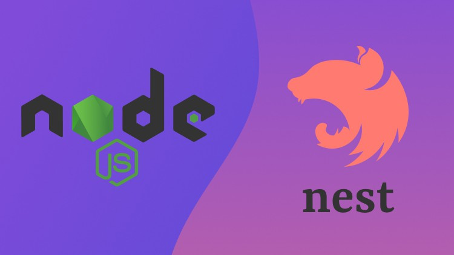

# Calculadora em JavaScript

## 💻 Projeto

[PT-BR]
O projeto foi desenvolvido na Ignite Lab de NodeJS da Rocketseat, o objetivo é criar um microserviço de notificações utilizando o NEST framework.
Pude revisar conceitos importantes sobre programação de alto nível, como POO, SOLID, Clean Architecture, além de ter meu primeiro contato com testes unitários.
[ENG]
The project was developed at Rocketseat's Ignite NodeJS Lab, the goal is to create a notification microservice using the NEST framework.
I was able to review important concepts about high-level programming, such as OOP, SOLID, Clean Architecture, in addition to having my first contact with unit testing.

## 🚀 Tecnologias

- NodeJS
- TypeScript
- NestJS
- Jest 
- Git e GitHub

## 📧 Contato

- Email: mathtg2@gmail.com
- LinkedIn: https://www.linkedin.com/in/matheus-patrickz/

